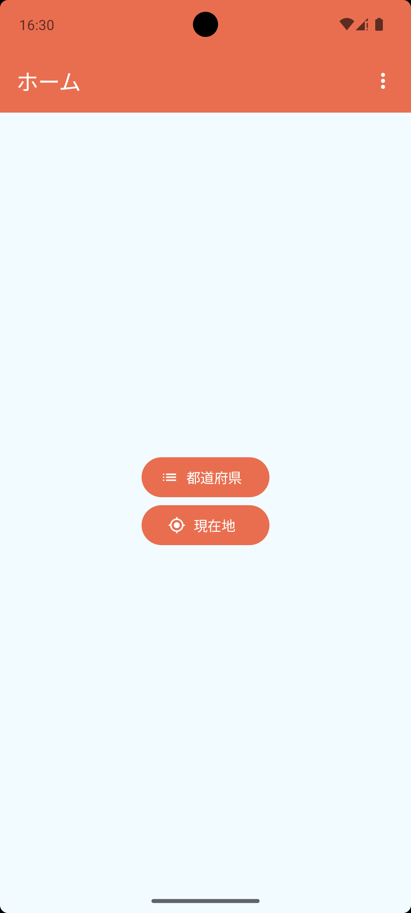
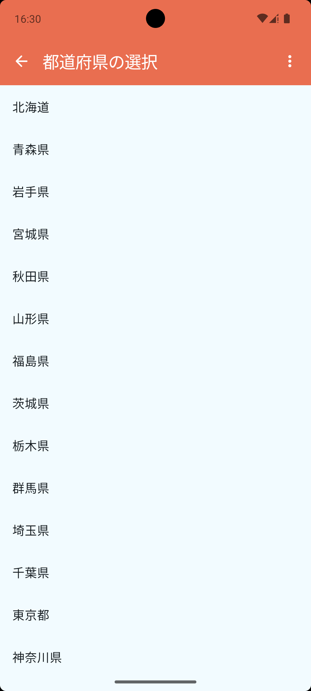
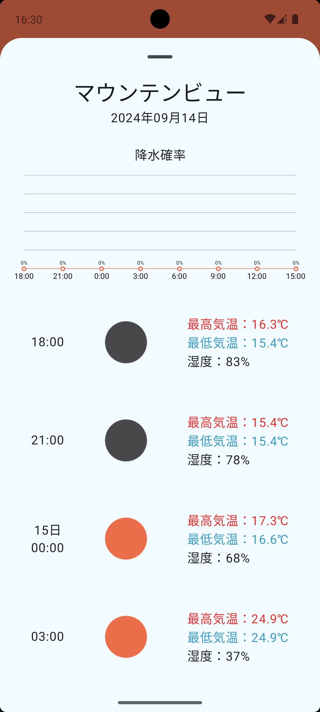

## お天気アプリを作る

以前、研修で作成した [お天気アプリ](https://github.com/yuki-toake/training-weather-app) を Jetpack compose を使用して作成し直した Repository

## Screenshots

| ホーム                         | 選択画面                        | 詳細画面                        |
|-----------------------------|-----------------------------|-----------------------------|
|  |  |  |

## APIキーの設定方法

[`secrets.defaults.properties`](secrets.defaults.properties) のようにプロジェクト直下の `local.properties` にAPIキーを記載

``` properties
WEATHER_API_KEY={API key}
```

## References

- [Now in Android](https://github.com/android/nowinandroid)
